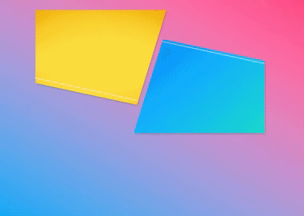
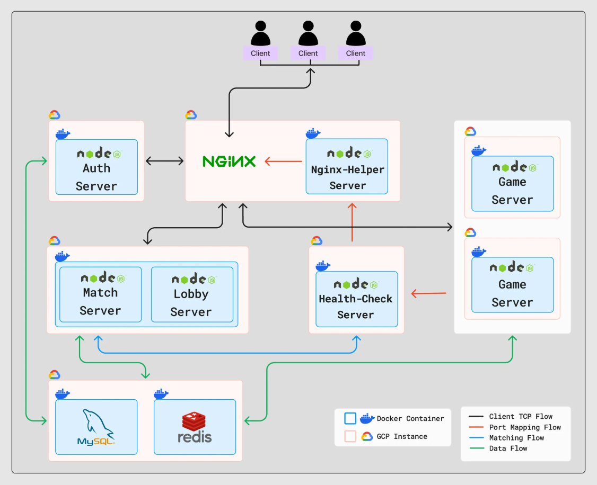

<!-- PROJECT LOGO -->
 

  

  <h3 align="center">War of Paws</h3>

  

  2024.11.13 ~ 12.23  
     
    <a href="https://ckd0dn.itch.io/catdogwar">Download</a>
    ·
    <a href="https://crimson-canary-811.notion.site/even-135098b94410807aa5efd3432802f6b8">냥멍대전 기획안</a>
    ·
    <a href="https://www.notion.so/teamsparta/283419ca4aad4f1698294487e876b844">냥멍대전 브로슈어</a>
  

<!-- TABLE OF CONTENTS -->

  
목차 확인

  <ol>
    <li>
      <a href="#project-description">🎮 프로젝트 설명</a>
    </li>
    <li>
      <a href="#tech-stack">🛠️ 기술 스택</a>
    </li>
    <li>
      <a href="#technical-goals">🎯 기술적 목표</a>
    </li>
    <li>
      <a href="#server-architecture">🗺️ 서버 아키텍쳐</a>
    </li>
    <li>
      <a href="#key-code">📌 핵심 코드</a>
    </li>
    <li>
      <a href="#troubleshooting">🚨 트러블 슈팅</a>
    </li>
    <li>
      <a href="#team-members">팀원</a>
    </li>
    <li>
      <a href="#etc">etc</a>
      <ul>
        <li><a href="#data-management">게임 데이터 저장 및 관리</a></li>
        <li><a href="#technical-decisions">기술적 의사 결정</a></li>
        <li><a href="#related-links">관련 링크</a></li>
      </ul>
    </li>
  </ol>

<h2 id="project-description">🎮 프로젝트 설명</h2>

<!-- 브로슈어에 들어갈 주요 컨텐츠의 이미지를 여기 넣으면 될듯. 아래 이미지는 임시 -->

2명의 플레이어가 고양이파 vs 강아지파로 나뉘어 상대방의 기지를 무너뜨리는 **RTS 게임**입니다.

<h2 id="tech-stack">🛠️ 기술 스택</h2>

### ☁️ 서버

&nbsp;
&nbsp;
&nbsp;
&nbsp;

### 🖥️ 클라이언트

&nbsp;
&nbsp;

### 🔌 Socket Programming

 &nbsp;
&nbsp;

### 🔐 인증

&nbsp;
&nbsp;

### 🗂️ 데이터베이스

&nbsp;
&nbsp;

### 🚀 DevOps/Infra

&nbsp;
&nbsp;
&nbsp;
&nbsp;

<h2 id="technical-goals">🎯 기술적 목표</h2>

- **실시간 대전**
  - 안정적이고 신뢰성 있는 실시간 데이터 전송을 위해 **TCP 소켓**을 기반으로 멀티플레이 환경을 구현
- **동시성 제어**
  - 패킷 요청에 의한 핸들러 처리 시 공유 리소스 접근에 대하여 데이터의 일관성과 무결성을 보장
- **분산 서버**
  - 요청을 여러 서버에 분산하여 성능 병목을 방지
  - 필요에 따라 손쉬운 확장과 일부 서버 장애 시에도 서비스 지속성 유지
- **배포 및 운영**
  - 코드 품질과 배포 신뢰성을 높이고, 반복적인 작업을 자동화하여 개발 속도와 효율성을 극대화
  - 클라우드 환경에서 손쉬운 배포와 스케일링 지원

<h2 id="server-architecture">🗺️ 서버 아키텍쳐</h2>

<h2 id="troubleshooting">🚨 트러블 슈팅</h2>
<!-- 2-3개 더 추가 -->

- [🏹 연속 패킷 처리 오류](https://www.notion.so/teamsparta/15f2dc3ef514816895dedb7084fac5fc)
- [💣️ 비정상 클라이언트의 무차별 패킷 전송으로 인한 아이피 차단](https://www.notion.so/teamsparta/15f2dc3ef514814e81dadfd75425d30d)
- [⚙️ README 수정만으로 실행되는 Github Actions](https://www.notion.so/teamsparta/README-Github-Actions-0642a09ce459464aa7b3dfee076ee047)

이 외에도 **클라이언트 팀의 트러블 슈팅**과 **서버 팀의 다른 트러블 슈팅**은 [TROUBLE-SHOOTING.md](./TROUBLE-SHOOTING.md)에서 확인할 수 있습니다.

<h2 id="team-members">팀원</h2>

### 서버

| 이름   | email                   | github                                                             |
| ------ | ----------------------- | ------------------------------------------------------------------ |
| 송승환 | lirymambo@gmai.com      | [https://github.com/ShrimpManiac](https://github.com/ShrimpManiac) |
| 김현진 | hydrated200ml@gmail.com | [https://github.com/rlaguswls2](https://github.com/rlaguswls2)     |
| 양성철 | r_louis@naver.com       | [https://github.com/tjdcjf1996](https://github.com/tjdcjf1996)     |
| 한민우 | mwj12205@gmail.com      | [https://github.com/mwj1205](https://github.com/mwj1205)           |

### 클라이언트

| 이름   | email                  | github                                                             |
| ------ | ---------------------- | ------------------------------------------------------------------ |
| 윤치훈 | smartb12@naver.com     | [https://github.com/CHICHIBAEBAE](https://github.com/CHICHIBAEBAE) |
| 박창우 | changwoo1208@naver.com | [https://github.com/ckd0dn](https://github.com/ckd0dn)             |
| 이현장 | makelee1379@gmail.com  | [https://github.com/Leehj950](https://github.com/Leehj950)         |

### 기획

| 이름   | email | github |
| ------ | ----- | ------ |
| 서정재 | 0321sjj@naver.com | [https://github.com/Besin](https://github.com/Besin)       |

<h2 id="etc">etc</h2>

<h3 id="data-management">게임 데이터 저장 및 관리</h3>

- [패킷 명세서](https://www.notion.so/teamsparta/15f2dc3ef51481238d03cd280a77e0aa)
- [API 명세서](https://www.notion.so/teamsparta/API-15f2dc3ef5148102a213f122efe75412)

<h3 id="technical-decisions">기술적 의사 결정</h3>

- [Game Server](https://www.notion.so/teamsparta/Game-Server-15f2dc3ef5148149b6a2e257b4bded30)
- [Distributed Server](https://www.notion.so/teamsparta/Distributed-Server-15f2dc3ef5148111af18ee0074540db4)
- [DataBase](https://www.notion.so/teamsparta/DataBase-15f2dc3ef514812082b5c52d755dd017)
- [DevOps](https://www.notion.so/teamsparta/DevOps-15f2dc3ef51481f1a560eb23c4fd1e0b)

<h3 id="related-links">관련 링크</h3>

- 📗 [팀 노션](https://www.notion.so/teamsparta/e3e44c9e021e4f7b9701144fadb9187f)
- 📁 **GitHub Repositories**:
  -  [인증서버](https://github.com/BnW-Developers/War-Of-Paws-Auth-Server)
  -  [로비-매칭서버](https://github.com/BnW-Developers/War-Of-Paws-Lobby-Matching-Server)
  -  [Nginx-헬퍼 서버](https://github.com/BnW-Developers/Nginx-Helper-Server)
  -  [헬스체크 서버](https://github.com/BnW-Developers/War-Of-Paws-Health-Server)
